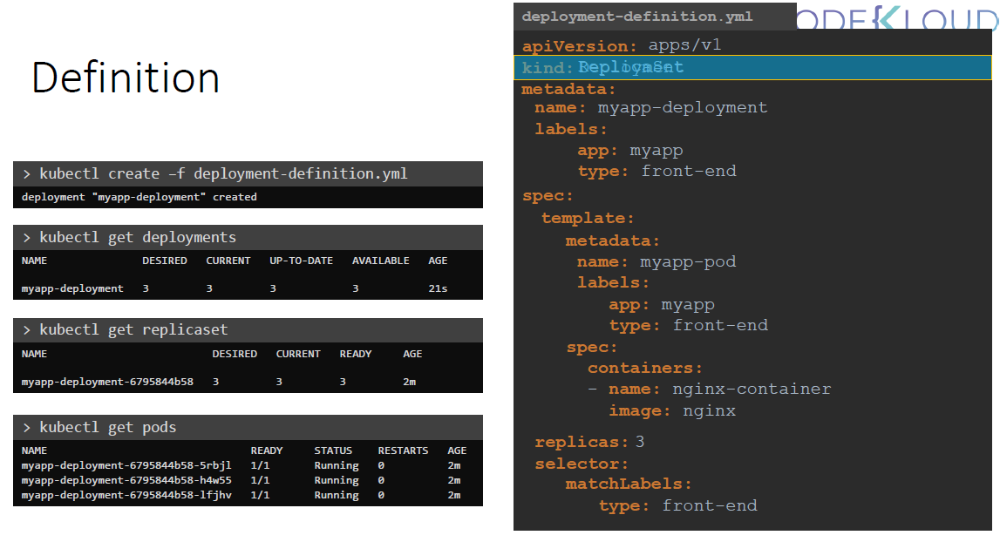
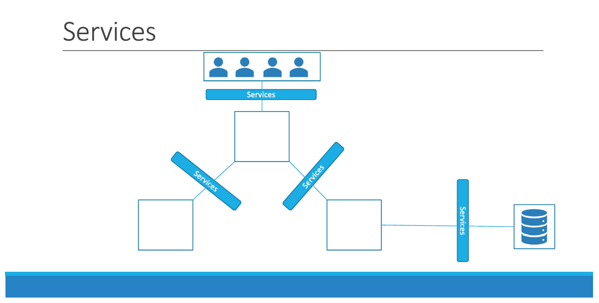

# Section 1: Introduction

Skipped (Introductory videos. No content)

# Section 2: Core Concepts

### 09. Core Concepts Section Introduction

Simply the Introduction

### 10. Download Presentation Deck for this section

### 11. Cluster Architecture


Kubernetes cluster consists of a set of nodes which may be physical or virtual. 
It can be on-premise or on-cloud that hosts applications in the form of containers.
The `Worker Nodes` are the ships that can load containers.
But somebody needs to load the containers on the ships and not just load but plan to load, identify the right ships, store information about the ships, monitor or track the containers on the ships, manage the whole loading process, etc. This is done by the control ships. The control ships are the `Master nodes` in the Kubernetes cluster.

The Master Nodes does all its work using a set of components called the `Control Plane Components`. Let's look at all of these components now: \
(i) **ETCD** is a highly available `key-value-store` database that stores information in a `key-value-format`

(ii) **Kube-Scheduler** is a component of the kuberenetes control-plane. It identifies the right node to place a container based on the container's resource requirement, the worker node capacity or any other policies or contrains such as taints and tolerations, node affinity rules that are on them. 

(iii) The Operations teams handles takes care of ship handling, traffic control, etc., they deal with issues related to damages, the route different ships take, etc, the cargo teams takes care of the containers, when a container is damaged or distroyed they make sure new containers are made. Similarly they have controllers which takes care of different areas.
Controllers-Managers - Node controllers, replication controllers, etc.,

(iv) Who manages these components at a high level
**Kube-APIServer** is the primary management component of kubernetes. The Kube-APIServer is responsible for orchestrating all operations within the cluster. It exposes the kubernetes API which is used by external users to perform management operations on the cluster as well as the controllers to monitor the state of cluster and make necessary changes as required and by the worker nodes to communicate with the server. 

(v) **Container Runtime** everything is in a container form here, so in every node there is a container runtime

(vi) **Kubelet** is an agent that runs on each node in a cluster. It listens for instructions from the kube-apiserver and deploys or destroys containers in the nodes as required. It periodically fetches status report from the kubelet to monitor the status of the nodes and containers on them. 

(vii) **Kube-proxy** Application running on the worker nodes need to `communicate` to each other like if you are running a webserver running in a container in a node and a database containers on another container on another node. Communications are enabled by the Kube-proxy. It ensure that the necessary rules are in place on the worker node to allow the containers running on them to reach each other.

### 12. Docker vs ContainerD

Skipping this one just for now


13. ETCD For Beginners

ETCD is a distributed reliable key-value store that is Simple, Secure and Fast

Installing ETCD
(a) Download the Binaries
    - curl -L https://github.com/etcd-io/etcd/release/download/.....

(b) Extract
    tar xzvf stcd-v3.3.11....

(c) Run ETCD Service
    ./etcd


    When you start/run the ETCD, it starts a service which runs on port 2379 by default you can then attach any client with the etcd service to store and retrieve any information.
    The default client which come with etcd is etcd control client. It is a command line client for etcd. You can use it to store and retrieve  key-value pairs. To store any key-value pair:
    
```ssh
    ./etcdctl set key1 value1
```

To retrieve the stored data, run :
```ssh
    ./etcdctl get key1
    Output: Value1
```

If you simply want to view more options in etcd type etcdctl without any arguement:
./etcdctl
- displays all the options


You might come accross different versions of etcd commands. So let's check the versions:
v0.1 Aug 2013
v0.5 Dec 2014
`v2.0 Feb 2015`
`v3.1 Jan 2017`
     Nov 2018 CNCF

The most significant is the change from v2 to v3. The API version changed in this. Etcd command changed as well. The set and get commands were changed.

To find out the version: \
./etcdctl --version
Output:
    etcd version 3.3.11
    API version: 2
- remember there are two versions here one for etcd and another for api


So, to change the etcdctl to work with api version 3 either set the environment variable called etcdctl_api=3 for each command. So right before you run each command
or you can export it as an environment variable for the entire session using the export command.
Also note that with v3 is a command. Version is now a command and not an option as it was with v2. So in v2 that was a option now its a command. If you now run:
./etcdctl
Output:
    VERSION:
        3.3.11
    API VERSION
        3.3
    COMMANDS:
            get     Gets the key or a range of keys
            ...     ...


Now after the v3,
The command to set the value is:
./etcdctl put key1 value1

The command to get the value is:
./etcd get key1
Output:
    key1
    value1

14. ETCD in Kubernetes

The ETCD data store stores information regarding the cluster such as:
- Nodes
- Pods
- Configs
- Secrets
- Accounts
- Roles
- Bindings
- Others

Every information that we see when we run the kubectl get command is from the etcd server
Everything that we do like adding additional nodes, pods etc is updated in etcd server
Only after it is updated in the etcd server, the change is considered complete.

There two types of kuberenetes deployment shown in this course: 
- Deployment from scratch and 
- Using the kubeadm tool.
Cluster from scratch
If you setup your cluster from scratch then you have to deploy etcd and you have to download the binaries yourself- installing the binaries and configuring etcd as a service in your master node.
There are many options passed to the service. A number of them related to certificates.
another one is:
--advertise-client-urls https://${INTERNAL_IP}:2379 \\
This is the address on which the etcd listens. It happens to be on the IP of the server and on the port 2379- the default port where etcd listens.
This is the URL that should be configured on the kube-apiserver when it tries to reach the etcd server.

Cluster using kubeadm
The kubeadm deploys the etcd server as a pod in the kube-system namespace:
kubectl get pods -n kube-system
To list all keys stored by kubernetes:
kubectl exec etcd-master -n kube-system etcdctl get / --prefix -keys-only

In a high availability environment, you will have multiple master nodes in your cluster hence you will have multiple etcd instances spread accross master nodes. In such cases make sure that the etcd instances know about each other by setting the right parametre in the etcd service configuration. The initial cluster option is where you must specify the different instances of the etcd service. 

15. ETCD - Commands (Optional)

(Optional) Additional information about ETCDCTL Utility

ETCDCTL is the CLI tool used to interact with ETCD.

ETCDCTL can interact with ETCD Server using 2 API versions - Version 2 and Version 3.  By default its set to use Version 2. Each version has different sets of commands.

For example ETCDCTL version 2 supports the following commands:

etcdctl backup
etcdctl cluster-health
etcdctl mk
etcdctl mkdir
etcdctl set


Whereas the commands are different in version 3

etcdctl snapshot save 
etcdctl endpoint health
etcdctl get
etcdctl put

To set the right version of API, set the environment variable ETCDCTL_API command

export ETCDCTL_API=3


When API version is not set, it is assumed to be set to version 2. And version 3 commands listed above don't work. When API version is set to version 3, version 2 commands listed above don't work.


Apart from that, you must also specify path to certificate files so that ETCDCTL can authenticate to the ETCD API Server. The certificate files are available in the etcd-master at the following path. We discuss more about certificates in the security section of this course. So don't worry if this looks complex:

--cacert /etc/kubernetes/pki/etcd/ca.crt     
--cert /etc/kubernetes/pki/etcd/server.crt     
--key /etc/kubernetes/pki/etcd/server.key


So for the commands I showed in the previous video to work you must specify the ETCDCTL API version and path to certificate files. Below is the final form:


kubectl exec etcd-master -n kube-system -- sh -c "ETCDCTL_API=3 etcdctl get / --prefix --keys-only --limit=10 --cacert 
/etc/kubernetes/pki/etcd/ca.crt --cert /etc/kubernetes/pki/etcd/server.crt  --key /etc/kubernetes/pki/etcd/server.key" 


16. Kube-API Server

This is the primary management component in kubernetes
  
When you run a kube control command (kubectl). The kube control utility is reaching to the kube-apiserver. The kube-apiserver first authenticates the request and validates it. It then retrieves the data from the etcd cluster and responds back with the requested information. 
You don't really need the kubectl command line instead you can also invoke the api directly by sending the post request like:
 (a) Authenticate User
 (b) Validate Request
 (c) Retrieve Data
 (d) Update ETCD
 (e) Scheduler

In this case the API-Server creates a pod object without assigning it to any node, updates the information in the etcd server, updates the user that the pod has been created.
The scheduler continuously monitors the api-server and realises that there's a new pod with no node assigned, the scheduler identifies the right node to place the new pod on and communicates back to the kube-apiserver, the api-server then updates the information in the etcd cluster, the api-server then passes that information to the kubelet in the appropriate worker node, the kubelet then creates the pod on the node and instructs the container runtime engine to deploy the application runtime image once done the kubelet updates the status back to the api-server and the api-server then updates the data back in the etcd cluster. 
A similar pattern is followed everytime the change is requested.
The kube-apiserver is at the centre of all the different tasks that needs to be performed to make a change in the cluster. 
To summarise, the kube-apiserver is responsible for authenticating and validating request, retrieving and updating data in the etcd data store. Infact kube-apiserver is the only component that interacts with the etcd data store. the other components uses the api-server to perform the updates in the cluster in their respective areas.
If you bootstrapped your your cluster using kubeadm tool then you don't need to know this but if you're setting up this hardway then the kube-apiserver is available as a binary in the kubernetes release page. Download and run it as a service in your kubernetes master node. 

The kube-apiserver, just like etcd is run with a lot of parameters, as you can see below:
wget https://storage.googleapis.com/kubernetes-release/release/v1.13.0/bin/linux/amd64/kube-apiserver
ExecStart=/usr/local/bin/kube-apiserver \\
--advertise-address=${INTERNAL_IP} \\
--allow-privileged=true \\
--apiserver-count=3 \\
--authorization-mode=Node,RBAC \\
--bind-address=0.0.0.0 \\
--client-ca-file=/var/lib/kubernetes/ca.pem \\
--enable-admission-plugins=Initializers,NamespaceLifecycle,NodeRestriction,LimitRanger,ServiceAccount,DefaultStorageClass,ResourceQuota \\
--enable-swagger-ui=true \\
--etcd-cafile=/var/lib/kubernetes/ca.pem \\
--etcd-certfile=/var/lib/kubernetes/kubernetes.pem \\
--etcd-keyfile=/var/lib/kubernetes/kubernetes-key.pem \\
--etcd-servers=https://127.0.0.1:2379 \\
--event-ttl=1h \\
--experimental-encryption-provider-config=/var/lib/kubernetes/encryption-config.yaml \\
--kubelet-certificate-authority=/var/lib/kubernetes/ca.pem \\
--kubelet-client-certificate=/var/lib/kubernetes/kubernetes.pem \\
--kubelet-client-key=/var/lib/kubern

We will install all of these indiviadually later 

Let's look at a few of them:
Certificatates - these help in setting up connectivity between different components
ETCD servers - The option etcd servers is where you specify the location of the etcd servers   --etcd-servers=https://127.0.0.1:2379 \\

To view api-server option in existing cluster:
If Kubeadm
the kubeadm deploys the kube-apiserver as a pod in the kube-system namespace on the master node you can see that by :
cat /etc/kubernetes/manifests/kube-apiserver.yaml
In a non-kubeadm setup:
cat /etc/systemd/system/kube-apiserver.service

You can also see the running process and the affective option by listing the process on the master node by searching the kube-apiserver

17. Kube Controller Manager

Manages various controllers in kubernetes.
In kubernetes its a process that continuously monitors the state of various components within the system and works towards bringing the whole system to the desired functioning state. 
Example:
- Deployment Controller
- CronJob
- Service Account Controller
- Node Controller
- Namespace Controller
- Job Controller
- Stateful-Set
- Daemon-Set (not a controller but have traits)
- PV-Binder-Controller
- Endpoint-Controller
- PV-Protection-Controller
- Replicaset
- Replication-Controller

All of these is packaged together in a single package known as Controller manager
When you install kubernetes controller manager different controllers get installed as well.
How to view the controller manager?:

Install:
wget https://storage.googleapis.com/kubernetes-release/release/v1.13.0/bin/linux/amd64/kube-controller-manager

Extract it and run it as a service

```ssh
kube-controller-manager.service

ExecStart=/usr/local/bin/kube-controller-manager \\
--address=0.0.0.0 \\
--cluster-cidr=10.200.0.0/16 \\
--cluster-name=kubernetes \\
--cluster-signing-cert-file=/var/lib/kubernetes/ca.pem \\
--cluster-signing-key-file=/var/lib/kubernetes/ca-key.pem \\
--kubeconfig=/var/lib/kubernetes/kube-controller-manager.kubeconfig \\
--leader-elect=true \\
--root-ca-file=/var/lib/kubernetes/ca.pem \\
--service-account-private-key-file=/var/lib/kubernetes/service-account-key.pem \\
--service-cluster-ip-range=10.32.0.0/24 \\
--use-service-account-credentials=true \\
--v=2
kube-controller-manager.service
Node Monitor Period = 5s
Node Monitor Grace Period = 40s
POD Eviction Timeout = 5m
--node-monitor-period=5s
--node-monitor-grace-period=40s
--pod-eviction-timeout=5m0s
--controllers stringSlice Default: [*]


A list of controllers to enable. '*' enables all on-by-default controllers, 'foo' enables the controller 
named 'foo', '-foo' disables the controller named 'foo'.
All controllers: attachdetach, bootstrapsigner, clusterrole-aggregation, cronjob, csrapproving, 
csrcleaner, csrsigning, daemonset, deployment, disruption, endpoint, garbagecollector, 
horizontalpodautoscaling, job, namespace, nodeipam, nodelifecycle, persistentvolume-binder, 
persistentvolume-expander, podgc, pv-protection, pvc-protection, replicaset, replicationcontroller,
```

View kube-controller-manager - kubeadm

```ssh
kubectl get pods -n kube-system

NAMESPACE NAME READY STATUS RESTARTS AGE
kube-system coredns-78fcdf6894-hwrq9 1/1 Running 0 16m
kube-system coredns-78fcdf6894-rzhjr 1/1 Running 0 16m
kube-system etcd-master 1/1 Running 0 15m
kube-system kube-apiserver-master 1/1 Running 0 15m
kube-system kube-controller-manager-master 1/1 Running 0 15m
kube-system kube-proxy-lzt6f 1/1 Running 0 16m
kube-system kube-proxy-zm5qd 1/1 Running 0 16m
kube-system kube-scheduler-master 1/1 Running 0 15m
kube-system weave-net-29z42 2/2 Running 1 16m
kube-system weave-net-snmdl 2/2 Running 1 16m -
```

It deploys the manager as a pod in the kube-system namespace on the master node

View kube-controller-manager options 
- kubeadm

```ssh
cat /etc/kubernetes/manifests/kube-controller-manager.yaml
spec:
containers:
- command:
- kube-controller-manager
- --address=127.0.0.1
- --cluster-signing-cert-file=/etc/kubernetes/pki/ca.crt
- --cluster-signing-key-file=/etc/kubernetes/pki/ca.key
- --controllers=*,bootstrapsigner,tokencleaner
- --kubeconfig=/etc/kubernetes/controller-manager.conf
- --leader-elect=true
- --root-ca-file=/etc/kubernetes/pki/ca.crt
- --service-account-private-key-file=/etc/kubernetes/pki/sa.key
- --use-service-account-credentials=true

```

View controller-manager options (Non-kubeadm setup)

```ssh
cat /etc/systemd/system/kube-controller-manager.service
[Service]
ExecStart=/usr/local/bin/kube-controller-manager \\
--address=0.0.0.0 \\
--cluster-cidr=10.200.0.0/16 \\
--cluster-name=kubernetes \\
--cluster-signing-cert-file=/var/lib/kubernetes/ca.pem \\
--cluster-signing-key-file=/var/lib/kubernetes/ca-key.pem \\
--kubeconfig=/var/lib/kubernetes/kube-controller-manager.kubeconfig \\
--leader-elect=true \\
--root-ca-file=/var/lib/kubernetes/ca.pem \\
--service-account-private-key-file=/var/lib/kubernetes/service-account-key.pem \\
--service-cluster-ip-range=10.32.0.0/24 \\
--use-service-account-credentials=true \\
--v=2
Restart=on-failure
RestartSec=5

```

You can also see the running process and the affective option by listing the process:

```ssh
ps -aux | grep kube-controller-manager
root 1994 2.7 5.1 154360 105024 ? Ssl 06:45 1:25 kube-controller-manager --
address=127.0.0.1 --cluster-signing-cert-file=/etc/kubernetes/pki/ca.crt --cluster-signing-key-file=/etc/kubernetes/pki/ca.key --controllers=*,bootstrapsigner,tokencleaner --
kubeconfig=/etc/kubernetes/controller-manager.conf --leader-elect=true --root-ca-file=/etc/kubernetes/pki/ca.crt --service-account-private-key-file=/etc/kubernetes/pki/sa.key
--use-service-account-credentials=true
```

18. Kube Scheduler

The scheduler is only responsible for deciding which pod goes on which node, it doesn't actually places the pod on the nodes- that's the job of the kubelet. The kubelet is who creates the pod on the node. The scheduler only decides which pod goes where. 
The scheduler places the pods on certain nodes based on certain criteria. You may have pods with certain resource requirements. You can have nodes in the cluster dedicated to certain applications. So, how this scheduler assign these pods? The scheduler looks at each pod and tries to find the best node for it. e.g., It has a set of cpu and memory requirement the scheduler goes for two phase to identify the best node for the pod:
Phases:
    (a) Filter Nodes 
    (b) Ranks Nodes

    (a) Filter Nodes: The scheduler tries to filter out the nodes that don't fit the profile for this pod. E.g., the nodes that don't have sufficient cpu and memory resources needed/requested for the pod. This way few nodes are filtered out so we are not left with fewer nodes where the pods can be placed.
    (b) Ranks Nodes : Suppose there are two nodes left, how does the scheduler picks one of the two? The scheduler ranks the nodes to identify the best fit for the pod. It uses a priority function to assign a score to the nodes on a scale of 0 to 10. e.g., the scheduler calculates number of resources that would be free on the nodes after placing the pod on them. The nodes which will be having more number of resources free even after putting the pod in the node will be ranked better and so that will be decided.

There are other way also how nodes are selecetd like:
- Resource Requirements and Limits
- Taints and Tolerations
- Node Selectors/Affinity

Installing the kube-scheduler

wget https://storage.googleapis.com/kubernetes-release/release/v1.13.0/bin/linux/amd64/kube-scheduler

Extract it and run it as a service

kube-scheduler.service

ExecStart=/usr/local/bin/kube-scheduler \\
--config=/etc/kubernetes/config/kube-scheduler.yaml \\
--v=2

Now how do you view the kube-scheduler options?

If you have set it up with kubeadm:
The kubeadm tool deploys the kubescheduler as a pod in the kube-system namespace on the masternode.

cat /etc/kubernetes/manifests/kube-scheduler.yaml

spec:
containers:
- command:
- kube-scheduler
- --address=127.0.0.1
- --kubeconfig=/etc/kubernetes/scheduler.conf
- --leader-elect=true

You can also see the running process and affective options by listing the process on the master node and searching for kube-scheduler

ps -aux | grep kube-scheduler

root 2477 0.8 1.6 48524 34044 ? Ssl 17:31 0:08 kube-scheduler --
address=127.0.0.1 --kubeconfig=/etc/kubernetes/scheduler.conf --leader-elect=true


19. Kubelet
The kubelet registers the node on the kubernetes cluster("registers" means the kubelet informs the control plane that the node is available for running workloads.Like The kubelet contacts the API server with its node details (e.g., CPU, memory, hostname)). When it receives the intruction to load a container or a pod on a node it requests the container runtime engine which maybe docker to pull the required image to run an instance. The kubelet then continues to monitor the status of the pod and containers in it and reports to the kube-apiserver on a timely basis. 

If you use kubeadm to deploy the cluster, it doesn't automatically deploy the kubelets. Now that's the difference from other components.
You must manually install kubelet on your worker nodes. 
Download the installer, extract it and run it as a service.

How do you install a kubelet normally:

wget https://storage.googleapis.com/kubernetes-release/release/v1.13.0/bin/linux/amd64/kubelet

kubelet.service

ExecStart=/usr/local/bin/kubelet \\
--config=/var/lib/kubelet/kubelet-config.yaml \\
--container-runtime=remote \\
--container-runtime-endpoint=unix:///var/run/containerd/containerd.sock \\
--image-pull-progress-deadline=2m \\
--kubeconfig=/var/lib/kubelet/kubeconfig \\
--network-plugin=cni \\
--register-node=true \\
--v=2

You can view the running process and the affective options by listing the process on the worker node and searching for kubelet.

ps -aux | grep kubelet

root 2095 1.8 2.4 960676 98788 ? Ssl 02:32 0:36 /usr/bin/kubelet --bootstrap-kubeconfig=/etc/kubernetes/bootstrap-kubelet.conf --kubeconfig=/etc/kubernetes/kubelet.conf --
config=/var/lib/kubelet/config.yaml --cgroup-driver=cgroupfs --cni-bin-dir=/opt/cni/bin --cni-conf-dir=/etc/cni/net.d --network-plugin=cni
 

20. Kube-Proxy
 Within a kubernetes cluster every pod can reach every other pod. This is accomplished by deploying pod networking solution to the cluster. A pod network is an internal virtual network that spans accross all the nodes in the cluster to which all the pods are connected through this network they are able to communicate with each other. There are many solution as such. e.g., I have a web app deployed in the 1st node and a database application deployed on the 2nd. The web app reached the db app simply by using the ip of the pod but there is no guarantee that the ip of the database will always remain the same. So a better way to reach the db app is by using the service so we create the service to expose the database app accross the cluster. The web app can now access the database app using the name of the service 'db'. The service also gets an ip address assigned to it. whenever a pod tries to reach the service using its ip or name it forwards the traffic to the backend pod in this case the database. But what is this service and how does it get an ip? does this service joins the same pod network? The service cannot join the pod network because the service is not an actual thing - it's not a container like pod it doesn't have an interfaces or an actively listeing process - its a virtual component that only lives in kubernetes memory. But then we also said the service should be accessable accross the cluster from any nodes so how is that achieved? That's where kube-proxy comes in. 
 Kubeproxy is a process that run on each node in the kubernetes cluster. Its job is to look for new services and everytime a new service is created it create an appropriate rules on each node to forward traffic to those services to the backend pods. One way it does this is by ip tables rules, in this case it creates ip tables rule on each node in the cluster to forward traffic heading towards the ip of the service which is 10.96.0.12 to the ip of the actual pod which is 10.32.0.15. So that;s how kube proxy configure a service. More to come. This is high level over view


Installing kube-proxy

wget https://storage.googleapis.com/kubernetes-release/release/v1.13.0/bin/linux/amd64/kube-proxy

kube-proxy.service

ExecStart=/usr/local/bin/kube-proxy \\
--config=/var/lib/kube-proxy/kube-proxy-config.yaml
Restart=on-failure
RestartSec=5

View kube-proxy- kubeadm
The kubeadm tool deploy kubeproxy as a pod on each node
In fact it is deployed as a daemonset so a single pod is always deployed on each node in the cluster

kubectl get pods -n kube-system

NAMESPACE NAME READY STATUS RESTARTS AGE
kube-system coredns-78fcdf6894-hwrq9 1/1 Running 0 16m
kube-system coredns-78fcdf6894-rzhjr 1/1 Running 0 16m
kube-system etcd-master 1/1 Running 0 15m
kube-system kube-apiserver-master 1/1 Running 0 15m
kube-system kube-controller-manager-master 1/1 Running 0 15m
kube-system kube-proxy-lzt6f 1/1 Running 0 16m
kube-system kube-proxy-zm5qd 1/1 Running 0 16m
kube-system kube-scheduler-master 1/1 Running 0 15m
kube-system weave-net-29z42 2/2 Running 1 16m
kube-system weave-net-snmdl 2/2 Running 1 16m -

kubectl get daemonset -n kube-system

NAME DESIRED CURRENT READY UP-TO-DATE AVAILABLE NODE SELECTOR AGE
kube-proxy 2 2 2 2 2 beta.kubernetes.io/arch=amd64 1h

21. Recap - Pods

Before we proceed we have two assumptions: there is an app is already built and dockerised and push onto a docker repository like dockerhub etc so that k8s can pull it down on dockerhub and a kubernetes cluster is setup and all the services are up and running

A pod is the smallest object you can create in kubernetes.

When the load increases, we deploy another pod in the same node. If the node is falling short of reasources and further pods cannot be deployed in that node we create another node and deploy a pod there (within which we have the container). 
Pods have 1 to 1 relation with the containers but are we restricted to have single container on a single pod? No. A single pod can have multiple containers exept for the fact that there are not multiple containers of the same kind. 
In most cases we have a helper container in a single pod. This sometimes do some supporting tast for our application such as processing our users enter data, processing a files uploaded by the user, etc., and you want these helper containers to live along side you application container in that case you can have both of these containers in the same pod so that when a new app conatiner is created a helper container is also created and when it dies the helper also dies. These 2 container can also communicate with each other with the help of the network directly by refering to each other by 'local host' since they share the same network space plus they share the same storage space as well.
PODs Again!

Kubectl

kubectl run nginx

kubectl run nginx --image nginx
 
kubectl get pods

22. Pods with YAML

A kubernetes defination contains always four top level fields/root level properties :

pod-defination.yml
 apiVersion: v1
 kind:
 metadata:

 spec:


apiVersion: this is version of the kubernetes api version we are using the create the pod. different for different resources. Differet types are v1, app/v1

kind: type of object like pods, replica set, deployment, service
metadata: data about the object like name, 

spec: the container or image. is a dictionary. 

Once the file is created we can use the following command to create the pod:
kubectl create -f pod-defination.yml
- create a pod

To see it:
kubectl get pods
- lists all pods


kubectl describe pod my-app-pod
- describes the pod

23. Demo - Pods with YAML

Created a pod


### 24. Practice Test Introduction

Q2. Create a new pod with the nginx image.

`Solution`: kubectl run nginx --image=nginx


Q3. How many pods are created now?

Note: We have created a few more pods. So please check again.

Solutions: kubectl get pods

Q4. What is the image used to create the new pods?

You must look at one of the new pods in detail to figure this out.

Sol: kubectl describe pod <pod_name>

Q5. Which nodes are these pods placed on?

You must look at all the pods in detail to figure this out.

Sol: Run the command kubectl describe pod newpods-<id> and look at the node field.
Alternatively run kubectl get pods -o wide and check for the node the pod is placed on.

Q6. How many `containers` are part of the pod webapp?

Note: We just created a new POD. Ignore the state of the POD for now.

Sol: use the describe command and look how many containers are there under containers

Q7. What images are used in the new webapp pod?

You must look at all the pods in detail to figure this out.

Sol: describe and find it under container section

Q8. What is the state of the container agentx in the pod webapp?

Wait for it to finish the ContainerCreating state

Sol: Same process as previous

Q9. What is the reason of the error of agentx container?

Sol: Same process but look under the events section

Q10. What does the READY column in the output of the kubectl get pods command indicate?

Sol: running containers/total pods(check again)

Q11. Delete the webapp Pod.


Once deleted, wait for the pod to fully terminate.

sol: kubectl delete pod <pod_name>

Q12. Create a new pod with the name redis and the image redis123.


Use a pod-definition YAML file. And yes the image name is wrong!

Sol: 
Step -1:
kubectl run redis --image=redis123 --dry-run=client -o yaml > redis-definition.yaml
Step-2:
kubectl create -f redis-defination.yml

Q13. Now change the image on this pod to redis.


Once done, the pod should be in a running state.

Sol:
Use the kubectl edit command to update the image of the pod to redis.

kubectl edit pod redis
If you used a pod definition file then update the image from redis123 to redis in the definition file via Vi or Nano editor and then run kubectl apply command to update the image :-

kubectl apply -f redis-definition.yaml 


29. Recap - ReplicaSets

There are 2 reasons why we need replication controllers:
 (a) To ensure that a specified number of pods are running at all times- Even if you have a single pod a replication controller can help you to bringing up a pod if it dies.
 (b) Load Balancing and Scaling- We the number of pods increase we deploy another pod to balance the load accross 2 pods if the demand futher increase and if we were to run out of resources on our 1st node, we could deploy additional pods accross the other nodes in the cluster. So, the replication controller spans accross multiple nodes in the cluster. It helps us balance the load accross multiple pods on different nodes as well as scale our application when the demand increases. 

Replication controller and Replica sets are two similar terms both have the same purpose but they're not the same. 

Replication controller is the older technology which is being replaced by replica set. Replica set is the new  recommended way to setup replication. we will dicuss in depth later

Let's find out how we create replication controllers:

rc-defination.yaml

apiVersion: v1
kind: ReplicationController
metadata:
  name: myapp-rc
  labels:
    app: myapp
    type: front-end
spec:
   


To create a replication controller:
kubectl create -f rc-defination.yml
- creates a replication controller from the yaml manifest file

kubectl get replicationcontroller
- lists the replicationcontrollers

Check how many pods did it create:
kubectl get pods
- lists all the pods


Now let us find out replica set

Let's find out how the replica set yaml file looks like:


apiVersion: apps/v1
kind: ReplicaSet
metadata:
  name: myapp-replication
  labels:
    app: myapp
    type: front-end
spec:
   
The difference between Replication Controller and Replica Set are:


Replica set can also manage pods that were not created with the help of replica set creation.


kubectl create -f replicaset-defination.yml
- creates a replicaset from a yml file

kubectl get replicaset
- lists replicasets


## How to Scale replicas

1st Method:
You can go to the defination .yaml file and change the replicas to the desired number. Let's say 6

Then simply use the command 
kubectl replace -f replicaset-defination.yml
- replaces the replicaset if you have scaled or done any kind of changes

2nd Method:
kubectl scale --replicas=6 -f replicaset-defination.yml
- scales the replicas. Over here we haven't changed the defination file instead we have added the desired replicas as flag
- Here the number of replicas in the defination file will remain the same and will not change

## Command

kubectl create -f replicaset-defination.yml

kubectl get replicaset

kubectl delete replicaset myapp-replicaset
- Also deletes all underlying PODs

kubectl replace -f replicaset-defination.yml

kubectl scale --replicas=6 -f replicaset-definition.yml

### Practice Test - ReplicaSets

Skipping the easy questions

Q3. How about now? How many ReplicaSets do you see?
A. kubectl get replicaset

Q4. How many PODs are DESIRED in the new-replica-set?
A. kubectl get replicaset

Output:

NAME              DESIRED   CURRENT   READY   AGE
new-replica-set   4         4         0       6s

Hence: 4

Q5. What is the image used to create the pods in the new-replica-set?
A. kubectl describe pod new-replica-set-7b6q9

Q6. How many PODs are READY in the new-replica-set?

kubectl get pods

Q7. Why do you think the PODs are not ready?

A. Doesn't exist

Q8. Delete any one of the 4 PODs.

A. kubectl delete pod <podname>

Q9. How many PODs exist now?

A. Same beacuse of Replicaset

Q10. Why are there still 4 PODs, even after you deleted one?

A. Replicaset

Q11. Create a ReplicaSet using the replicaset-definition-1.yaml file located at /root/.

A. kubectl create -f replicaset

But there is a problem wth the version. It's written here as "v1". In replicasets the version has to be "app/v1"

You can check the version of replicasets by the following command:

kubectl api-resources | grep replicaset
- displays the version of the replicasets

So, we replace the apiVersion: v1 with apps/v1 and save

kubectl create -f replicaset-definition-1.yaml 
replicaset.apps/replicaset-1 created


Q12. Fix the issue in the replicaset-definition-2.yaml file and create a ReplicaSet using it.

A. The values for labels on lines 9 and 13 should match. i.e., the selector should match the label in the template
so, we change accordingly

Q13. Delete the two newly created ReplicaSets - replicaset-1 and replicaset-2
A. 

Q14. Fix the original replica set new-replica-set to use the correct busybox image.

A. The error is in the image name it should be "busybox"
    kubectl edit replicaset <new-replicaset>

Q15. Scale the ReplicaSet to 5 PODs.

kubectl scale --replica=5 -f new-replica-set - isse hua nahi

kubectl edit replicaset new-replica-set

then edited the replicas

Q16. Now scale the ReplicaSet down to 2 PODs.


Use the kubectl scale command or edit the replicaset using kubectl edit replicaset.

A. 

## 32. Deployment

Let's talk about how you might want to deploy your application in a production environment.
You want a webserver that you want to deploy in the production environment. You need not just one but multiple such web-servers. /
2ndly, whenever, newer versions of applications builds become available in the docker registry, you would like to upgrade your docker instances seemlessly. However when you upgrade your instances, you don't want to upgrade them at once as we just did (in replicasets above). This may impact users accessing our application. So, you might upgrade them one after the other- this is also known as rolling updates.
Suppose one of the upgrades you performed resulted in an unexpected error and you are asked to undo the change you would like to be able to rollback the changes that we recently carried out.
Finally, you would like to make multiple changes to your environment such as upgrading the webserver versions as well as scaling your environment as well as modifying the resource allocations etc you don't want to apply each change immidiatedly when the command is run instead, you would like to apply a **pause** to your environment, make the changes and then resume so that all the changes, so that all the changes are rolled out together. All of these capabilities are available with the kubernetes deployments. 

d:\OneDrive\DevOps Study\Kubernetes\deployment1-diagram.png

deployment defination yaml file:
The yaml file in deployments case would be same as replicaset, the difference will be the 'kind'. In 'kind', we will write as Deployment



To list all the objects in the cluster:
kubectl get all
- lists all the objects in the cluster


-------------
Here's a tip!

As you might have seen already, it is a bit difficult to create and edit YAML files. Especially in the CLI. During the exam, you might find it difficult to copy and paste YAML files from browser to terminal. Using the kubectl run command can help in generating a YAML template. And sometimes, you can even get away with just the kubectl run command without having to create a YAML file at all. For example, if you were asked to create a pod or deployment with specific name and image you can simply run the kubectl run command.

Use the below set of commands and try the previous practice tests again, but this time try to use the below commands instead of YAML files. Try to use these as much as you can going forward in all exercises

Reference (Bookmark this page for exam. It will be very handy):

https://kubernetes.io/docs/reference/kubectl/conventions/

Create an NGINX Pod

kubectl run nginx --image=nginx

Generate POD Manifest YAML file (-o yaml). Don't create it(--dry-run)

kubectl run nginx --image=nginx --dry-run=client -o yaml

Create a deployment

kubectl create deployment --image=nginx nginx

Generate Deployment YAML file (-o yaml). Don't create it(--dry-run)

kubectl create deployment --image=nginx nginx --dry-run=client -o yaml

Generate Deployment YAML file (-o yaml). Don't create it(-dry-run) and save it to a file.

kubectl create deployment --image=nginx nginx --dry-run=client -o yaml > nginx-deployment.yaml

Make necessary changes to the file (for example, adding more replicas) and then create the deployment.

kubectl create -f nginx-deployment.yaml

------------

Practice Test - Deployments

Q1. How many PODs exist on the system?

In the current(default) namespace.

A. kubectl get pods

Q2. How many ReplicaSets exist on the system?

In the current(default) namespace.

A. kubectl get replicaset

Q3. How many Deployments exist on the system?

In the current(default) namespace.

A. kubectl get deployment

Q4. Same quest to check the number of deployemnts 

A. 

Q5. How many replicasets (henceforth shortform will be used in this doc as rs)
A. kubectl get rs

Q6. How many PODs exist on the system now?
A. kubectl get pods

Q7. Out of all the existing PODs, how many are ready?
A. NAME                                   READY   STATUS             RESTARTS   AGE
frontend-deployment-6469748456-656xc   0/1     ImagePullBackOff   0          5m28s
frontend-deployment-6469748456-qvmjm   0/1     ImagePullBackOff   0          5m28s
frontend-deployment-6469748456-87glt   0/1     ImagePullBackOff   0          5m28s
frontend-deployment-6469748456-lczfc   0/1     ImagePullBackOff   0          5m28s

Q8. What is the image used to create the pods in the new deployment?
A. kubectl describe pods <podname>

Q9. Why do you think the deployment is not ready?
A. The image doesn't exists

Q10. Create a new Deployment using the deployment-definition-1.yaml file located at /root/.
A. vi deployment command. The error is with the 'kind' deployment with small 'd'. Make the d as uppercase.

Q11. Create a new Deployment with the below attributes using your own deployment definition file.


Name: httpd-frontend;
Replicas: 3;
Image: httpd:2.4-alpine

A. kubectl create deployment --image=httpd:2.4-alpine httpd-frontend --dry-run=client -o yaml > deployment-created.yaml

## 36. Services

Enable communication between various components within and outside of the application. It helps us connect apps together with other apps or users. E.g., our apps has groups pods running various sections such as :
a group for serving frontend loads to user,
other groups for running backend processes and 
a third group connecting to an external data source. 
It is services that enable connectivity between these groups of pods. Services enable to frontend application to be made available to end users, it helps communication between backend and frontend pods and helps in establishing connectivity with external data source.
Thus services enable loose coupling between microservices in our application.



External communication. 
How do we as external users access the webpage?

Kubernetes service is an object just like pods or replicasets. One of its use-case is to listen to a port on the node and forward request on that port to a port running the web app. This type of service is known as the nodePort service. 

Services Types

a. NodePort
    - Where the service makes an internal pod accessible on a port on the node to a port on the pod
b. ClusterIP
    - the service creates a virtual IP inside the cluster to enable communication between different services such as a set of front-end servers to a set of back-end servers
c. LoadBalancer
    - where we provision load balancer for our applications in supported cloud providers. E.g., to distribute load accross different web servers in your front-end tier.

Services in Detail:

a. NodePort
    - We said that it's external access to the application a service can help us map a port on the node to a port on the pod. 
    If we take a closer look, we see 3 ports involved:
    a. The port on the pod (where the actual server is running- Port 80 in this case)- This is known as the **`target port`** beacuse this is where the service forwards its request to.
    b. The 2nd port is the port on the service itself. It is simply referred to as `port`. Remember these terms are from the viewpoint of service itself. Service is like a virtual server inside the node inside the cluster, it has its own IP address and that IP address is called the `ClusterIP of the service`.
    c. Then we have the port on the node itself which we use to access the webserver externally and that is know as the `NodePort`. In our case it is set to `30008`. NodePorts can be in a valid range- which by default ca be from 30,000 to 32,767.

    Let's see how we can create the manifest:

    service-defination.yml

    apiVersion: v1
    kind: Service
    metadata:
        name: myapp-service

    spec:
        type: NodePort
        ports:
          - targetPort: 80
            port: 80
            nodePort: 30008

    Under spec, out of all the port the mandatort field is port. If you don't provide a targetPort, it will be assumed to be the port and if you don't provide a nodePort, a free port between the valid range between 30,000 to 32,767 is automatically allocated. Alos note that port is an array so that `-` under the port section is the first element in the array. You can have multiple such port mappings within a single service. 
    In the above dia we have mentioned everything like we have mentioned the ports but we have not mentioned the pod. There is nothing in the defination file that connects the service to the pod. We have mentioned the target port but we haven't mentioned the target pod on which pod? There could be 100s of pods running webservices on port 80. How do we do that. We will use labels and selectors to do this to link these together. The pod was created using a label we need to bring that label into this service defination file. So we will have new property in the above file known as selector. Pull the label from the pod defination file and put it under the selector section. This will link the service to the pod:

    apiVersion: v1
    kind: Service
    metadata:
        name: myapp-service

    spec:
        type: NodePort
        ports:
          - targetPort: 80
            port: 80
            nodePort: 30008
        selector:
          app: myapp
          type: front-end


Then run the following command to create the service:
```bash
kubectl create -f service-defination.yml
service "myapp-service" creater
   - creates a service resource using the file
```


